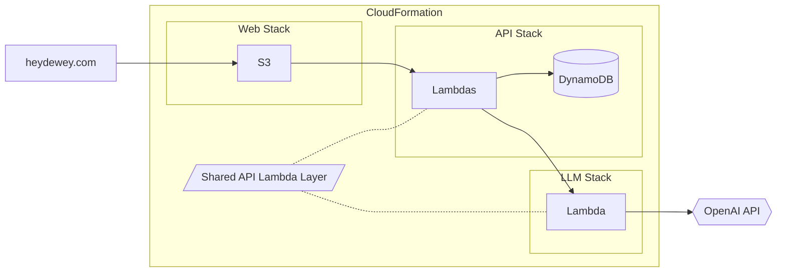
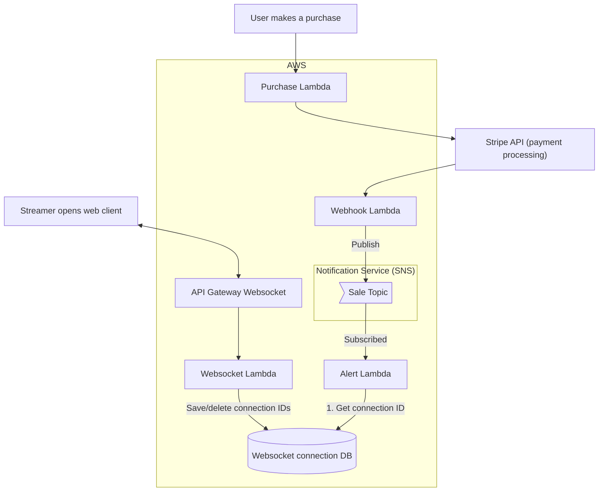

# [erkdong.github.io](https://erkdong.github.io/)

Built using pure HTML and JavaScript because I make great life decisions.

# Project technical details

For the curious, some details into how I built each project I've worked on.

## [Dewey](https://www.heydewey.com/)

| Technologies involved                                       |                                         |
| ----------------------------------------------------------- | --------------------------------------- |
| Frontend                                                    | TypeScript - React - Redux              |
| Backend                                                     | Python - AWS Lambda - DynamoDB - OpenAI |
| Infrastructure ([IaC](https://aws.amazon.com/what-is/iac/)) | AWS (CloudFormation - API Gateway - S3) |
| CI/CD                                                       | AWS CodePipeline                        |

This project ended up being a great crash course into [AWS SAM](https://aws.amazon.com/serverless/sam/), a tool by Amazon that aids development of infrastructure-as-code (IaC).

Amazon's implementation of IaC lets us define and deploy entire CloudFormation stacks using just a JSON or YAML template file. This makes it much easier to manage all the moving parts of an application stack.

The below diagram illustrates the overall system design, composed of 3 separate CloudFormation stacks and OpenAI for LLM support.

 

 

Additionally, the LLM stack is deployed using the CI/CD tool [CodePipeline](https://aws.amazon.com/codepipeline/), as a two-stage pipeline with a suite of unit tests. The Lambda Layer lets us define the LLM stack's API in a place that other stacks can read from.

## Twitch store alerts

This project was deceptively complex. Here's a high level diagram:

