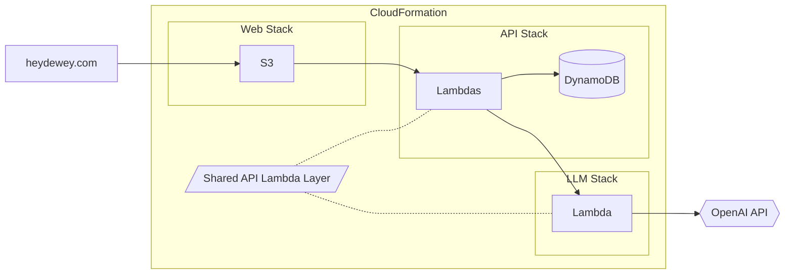
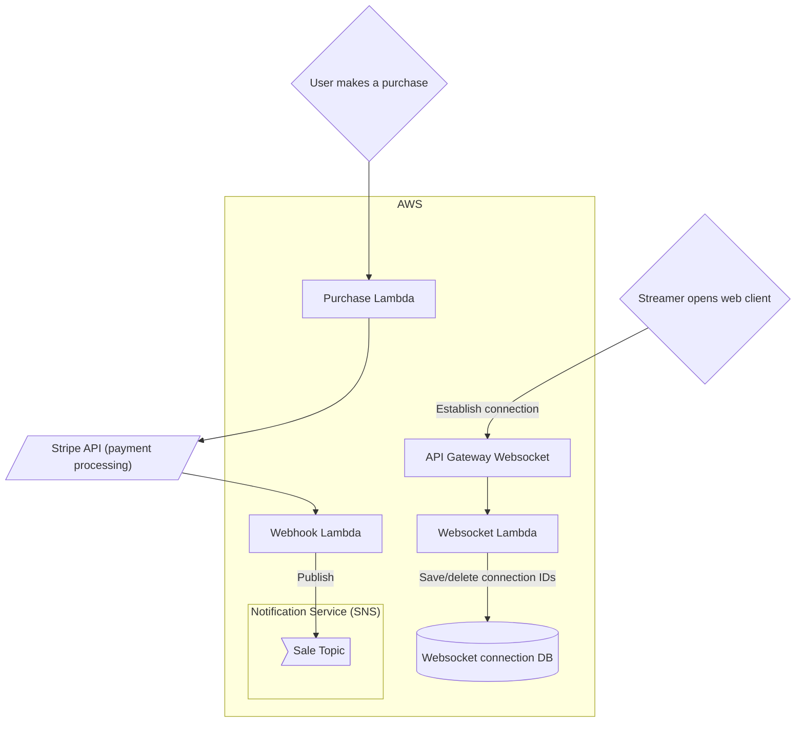
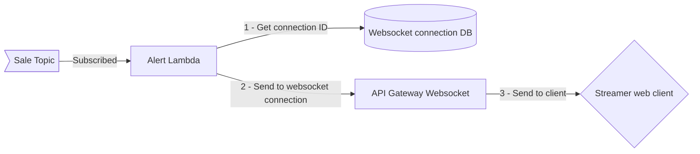

# [erkdong.github.io](https://erkdong.github.io/)

Built using pure HTML and JavaScript because I make great life decisions.

# Project technical details

For the curious, some details into how I built each project I've worked on.

## [Dewey](https://www.heydewey.com/)

| Technologies involved                                       |                                         |
| ----------------------------------------------------------- | --------------------------------------- |
| Frontend                                                    | TypeScript - React - Redux              |
| Backend                                                     | Python - AWS Lambda - DynamoDB - OpenAI |
| Infrastructure ([IaC](https://aws.amazon.com/what-is/iac/)) | AWS (CloudFormation - API Gateway - S3) |
| CI/CD                                                       | AWS CodePipeline                        |

This project ended up being a great crash course into [AWS SAM](https://aws.amazon.com/serverless/sam/), a tool by Amazon that aids development of infrastructure-as-code (IaC).

Amazon's implementation of IaC lets us define and deploy entire CloudFormation stacks using just a JSON or YAML template file. This makes it much easier to manage all the moving parts of an application stack.

The below diagram illustrates the overall system design, composed of 3 separate CloudFormation stacks and OpenAI for LLM support.

 

 

Additionally, the LLM stack is deployed using the CI/CD tool [CodePipeline](https://aws.amazon.com/codepipeline/), as a two-stage pipeline with a suite of unit tests. The Lambda Layer lets us define the LLM stack's API in a place that other stacks can read from.

## Twitch store alerts

| Technologies involved |                                         |
| --------------------- | --------------------------------------- |
| Backend               | NodeJS - AWS Lambda - DynamoDB - Stripe |
| Infrastructure        | AWS (API Gateway - SNS)                 |

This project was deceptively complex. Here's a high level diagram:

Two flows are happening independently of each other.

1. The streamer opens a custom built web page that renders the alert. The idea here is the streamer gives this page's URL to the streaming software, which has an internal browser that opens the page and displays whatever is on it on the livestream.

   - On load, the page establishes a websocket connection with our backend, which saves the connection ID to the database.

2. Separately, the user purchase flow provides a webhook that Stripe invokes when payment is complete. This webhook triggers a Lambda function, which then publishes a Sale topic event to Amazon SNS.

The following happens next:

The alert lambda is subscribed to the Sale topic published by the webhook lambda. The event object contains the data needed to get the appropriate connection ID from the database, then send the alert and its metadata to the streamer's client.
